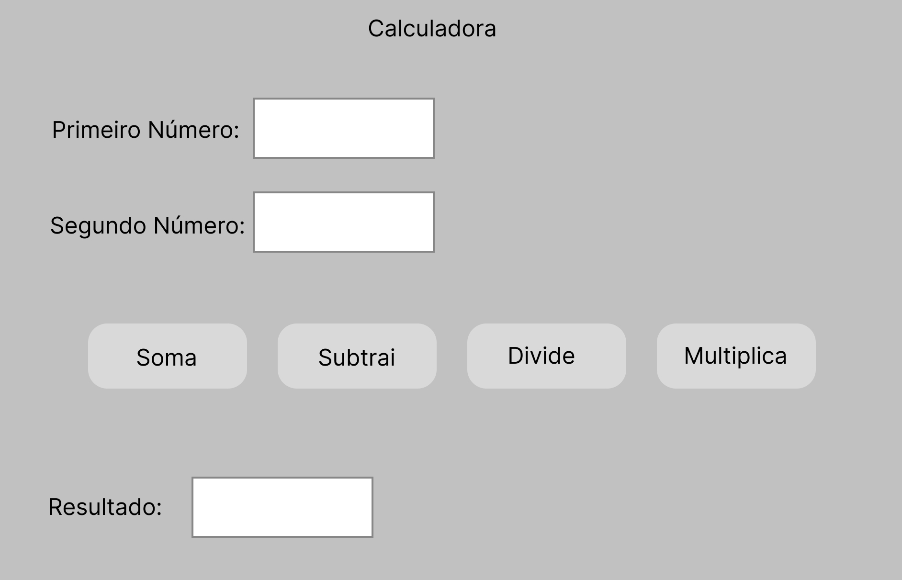

<h1 align="center"> Calculadora </h1>

Programa desenvolvido em JAVA com uso do Jframe para estilização da calculadora.

  <a href="#-tecnologias">Tecnologias</a>&nbsp;&nbsp;&nbsp;|&nbsp;&nbsp;&nbsp;
  <a href="#-projeto">Projeto</a>&nbsp;&nbsp;&nbsp;|&nbsp;&nbsp;&nbsp;
  <a href="#-layout">Layout</a>&nbsp;&nbsp;&nbsp;|&nbsp;&nbsp;&nbsp;
  

 

  

## 🚀 Tecnologias

Esse projeto foi desenvolvido com as seguintes tecnologias:

- JAVA
- Figma

## 💻 Projeto

Calculadora que realiza cálculos básicos da matemática.

## 🔖 Layout

Você pode visualizar o layout do projeto através [DESSE LINK](<https://www.figma.com/file/hctw5fPxosX01drdp0Hc6u/Calculator?type=design&t=RHafeuj4vrVqofhq-6>). É necessário ter conta no [Figma](https://figma.com) para acessá-lo.
